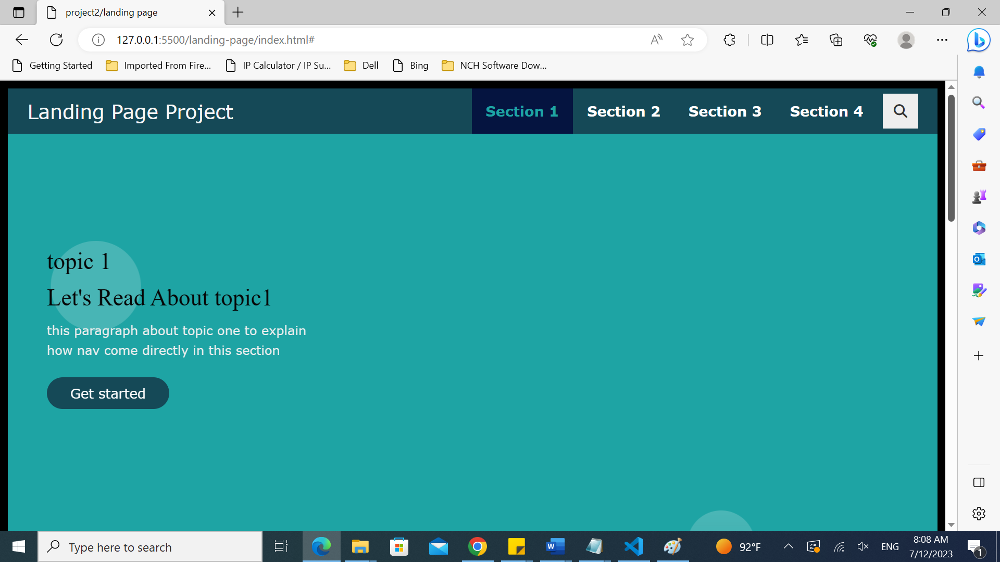

# Landing Page Project

## Table of Contents

* [Instructions](#instructions)

## Instructions

The starter project has some HTML and CSS styling to display a static version of the Landing Page project. You'll need to convert this project from a static project to an interactive one. This will require modifying the HTML and CSS files, but primarily the JavaScript file.

To get started, open `js/app.js` and start building out the app's functionality

For specific, detailed instructions, look at the project instructions in the Udacity Classroom.


# breif about my second project (Landing Page)

## INTRODUCTION

1-  This project build a multi-section landing page, with a dynamically updating navigational menu based on the amount of content that is added to the page.

2- Build  at least 4 content sections.

3- Build the navigation menu.It's dynamically create a navigation by JS

4- Add the most important functions in app.js

--Global Variables

--Helper Functions

--Main Functions
* build the nav
* Add class 'active' to section when near top of viewport
* scroll to anchor ID using scrollTO event

-- Events
*  Build menu 

* Scroll to section on link click

* Set sections as active

5- A Responsive layout of the landing page should be created to use across all devices, such as modern desktops, tablets, and phone browsers.


## website link

```
http://127.0.0.1:5500/landing-page/index.html#

```

## some project screenshoots

<div>



<div>


## conclusion


